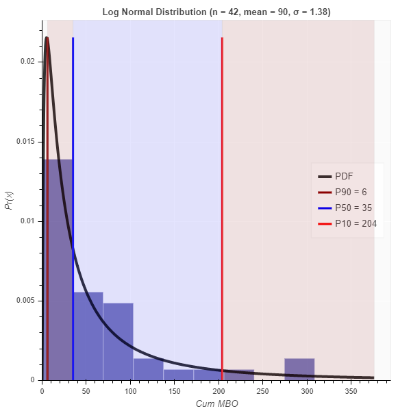
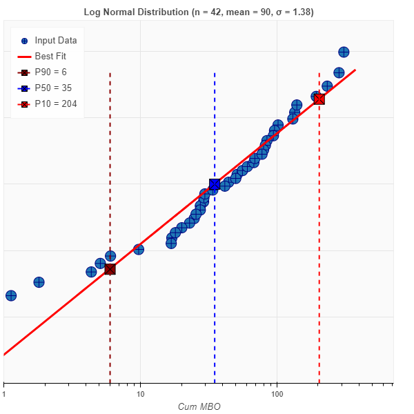

# petrolpy

This repository is meant to serve as an open source option for petroleum engineers and geoscientists with Python packages/modules. Check the wiki page for current projects. Please share any project ideas you may have. **All projects are a work in progress**.

---

You can run the notebooks by clicking the "launch binder" button above. The required packages are in the environment.yaml file.

---

## Highlights

* Log Normal Distribution Probability Density Function from data (EUR Example)

* Log Normal Distribution Probit Plot (EUR Example)

